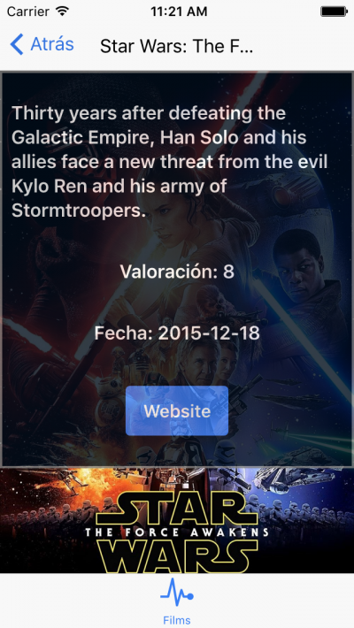

Drifty co. ha sacado recientemente la versión beta de **[Ionic Framework v2](http://ionic.io/2)**, que viene con grandes cambios, con la actualización a **[Angular2](https://angular.io/)**, y una actualización de sus componentes, una nueva navegación.

Además usan **[Webpack](https://webpack.github.io/)**, para compilar los archivos SCSS, JS y HTML en el que usan **[BabelJS](https://babeljs.io/)** para compilar ES6.

Vamos a realizar una aplicación sencilla, que pide las películas más populares de un servicio REST **[themoviedb](http://docs.themoviedb.apiary.io/)**, lo mostraremos en un listado, además tendrán un detalle.

A continuación podéis ver el resultado de la app, si queréis saltaros el tutorial, podéis visitar el siguiente enlace de github y descargaros el código fuente.

**[Ver código fuente](https://github.com/gabrielseco/learnionic2)**




# Instalación

Para instalar ionic v2 hay que seguir los siguientes pasos:

<ol>
  <li>Abrir la terminal</li>
  <li>Asegurarnos que tenemos node y npm instalados</li>
  <li>Ejecutar el siguiente comando</li>
</ol>

```sh
  npm install -g ionic@beta
```

# Crear una aplicación

Desde la terminal ejecutaremos el siguiente comando, que para las personas que estén familiarizadas con Ionic 1 les resultará conocido

```sh
  ionic start learnionic2 --v2
```

Nos genera la base del framework, para ejecutar la app que nos genera una aplicación con tabs por defecto

```sh
  cd learnionic2
  ionic serve
```

Nos ejecutará en nuestro navegador predeterminado en el puerto 8100 la App

Abrimos la carpeta para ver los archivos que se han generado


Nosotros por ahora solo nos tenemos que preocupar de hacer los cambios en el directorio /app.

"ionic serve" se encarga por nosotros de compilar los archivos scss y js que usen es6 por medio de Webpack.

# 1.- Cambiar tabs

En el directorio /app abrimos el archivo app.html que contiene el html de cada tab, dejamos una cambiándole sus propiedades.

```html
<ion-tabs>
  <ion-tab [root]=”films” tabTitle=”Films” tabIcon=”ion-ios-film”></ion-tab>
</ion-tabs>
<ion-overlay></ion-overlay>
```

Pasamos a editar el archivo app.js.

En el tenemos importado nuestras páginas y definimos el componente que vamos a asignar a cada tab.

Nuestro archivo debería quedar de la siguiente forma.

```typescript
import {App, Platform} from ‘ionic/ionic’;
//importamos la página films que vamos a crear a continuación
import {Films} from ‘./pages/films/films’;
@App ({
  templateUrl: ‘build/app.html’
})
export class MyApp {
  constructor(platform: Platform) {
  // se la asignamos a nuestra tab
   this.films = Films;
   platform.ready().then(() => {
   //se usa para usar características nativas de los móviles a través de cordova
   });
  }
}
```

# 2.- Crear nuestra página Films

Podemos borrar en el directorio pages,los directorios page1, page2, page3 ya que no las vamos a utilizar.

Creamos un directorio llamado films, que tendrá 3 archivos un films.html para nuestras vistas, un films.scss para modificar los estilos de la página y un archivo js en el que tendremos nuestra lógica.

En el fichero films.js importamos un provider que vamos a crear posteriormente para hacer nuestras llamadas AJAX a una API.

También importamos Page y NavController de Ionic.

```typescript
import {Page, NavController} from ‘ionic/ionic’;
import {FilmsData} from ‘../../providers/films-data’;
//Le decimos a la página que provider tiene que usar y la template que actuará como vista
@Page({
  templateUrl: ‘build/pages/films/films.html’,
  providers:[FilmsData]
})
//Films tiene un constructor con nav y films
export class Films {
  constructor(nav: NavController, films: FilmsData) {
   this.nav = nav;
   this.films = [];
   //hacemos la llamada al provider
  //nos devuelve las películas más populares
   films.getFilms().then(films => {
    console.log(‘films’,films)
    this.films = films.results;
   });
 }
}
```

La vista la crearíamos de la siguiente forma.

```html
<ion-navbar *navbar>
  <ion-title>Films</ion-title>
</ion-navbar>
<ion-content padding class=”page1″>
  <ion-card *ngFor=”#film of films” class=”film”>
    <ion-card-header>
      <button ion-item (click)=”goToFilmDetail(film)”>
        
        
        </img-thumbnail>
    </button>
    </ion-card-header>
    <ion-card-content class=”outer-content”>
      <ion-list>
        <ion-list-header>
          Descripción
        </ion-list-header>
        {{film.overview}}
      </ion-list>
    </ion-card-content>
  </ion-card>
</ion-content>
```

El ion-title nos permite definir el título de la vista que aparecerá en la parte superior del dispositivo.

Usamos un ngFor que actúa como ng-repeat en angular1 o un for en javascript o en cualquier lenguaje similar.

Asignamos a la imagen la ruta que nos devuelve la api y asignamos una descripción.

# 3.- Creación del provider

Para obtener los datos y que se pinten en nuestra vista, necesitamos hacer una llamada ajax.

En esta aplicación vamos a llamar a la API themoviedb para obtener las películas más populares del momento.

Creamos en el directorio /app la carpeta providers el archivo films-data.js.

En el importo  el módulo Http y el módulo Injectable para poder usarlo en films.js

El módulo nos permite hacer las llamadas Ajax.

```typescript
import {Injectable} from ‘angular2/core’;
import {Http} from ‘angular2/http’;
@Injectable()
export class FilmsData {
   constructor(http: Http) {
   // asignamos la propiedad http a this para usarla posteriormente
   //asignamos la clave de la nuestra api para usarla posteriormente
   this.http = http;
   this.api_key = ‘f9868bfa67c8ac93675e8de8a33cbd17’
  }
  load(url) {
   return new Promise(resolve => {
    this.http.get(url).subscribe(res => {
     this.data = (res.json());
     resolve(this.data);
   });
  });
}
  //llamamos a la api the moviedb
  //obtenemos las películas más populares del momento
  getFilms() {
   var url = ‘http://api.themoviedb.org/3/movie/popular?api_key=’+this.api_key
   return this.load(url).then(data => {
   return data;
  });
 }
}
```

Al finalizar la creación del provider ya tendremos el listado de películas listo, en el siguiente tutorial aprenderemos a usar la navegación y obtener los datos de la ficha de una película